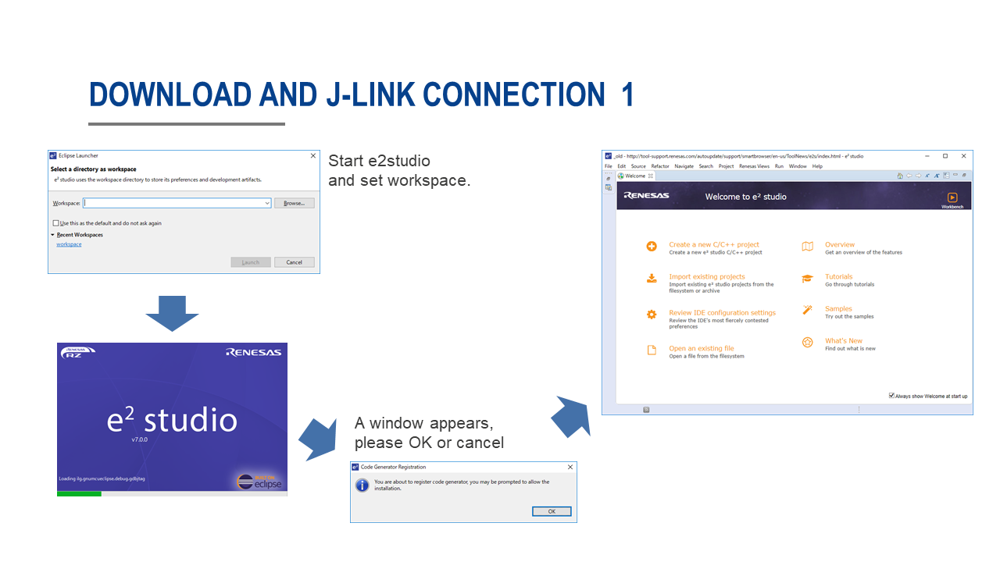
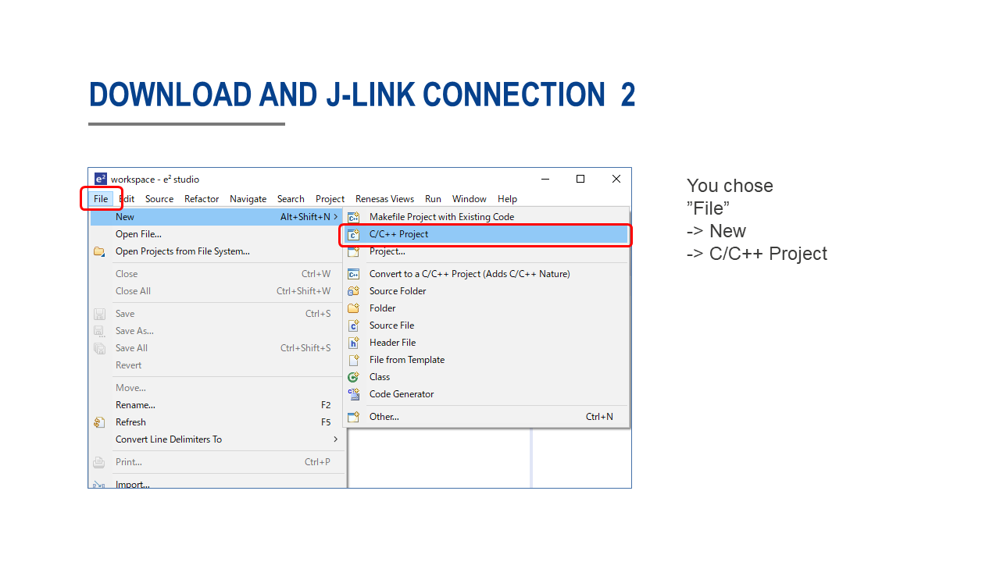
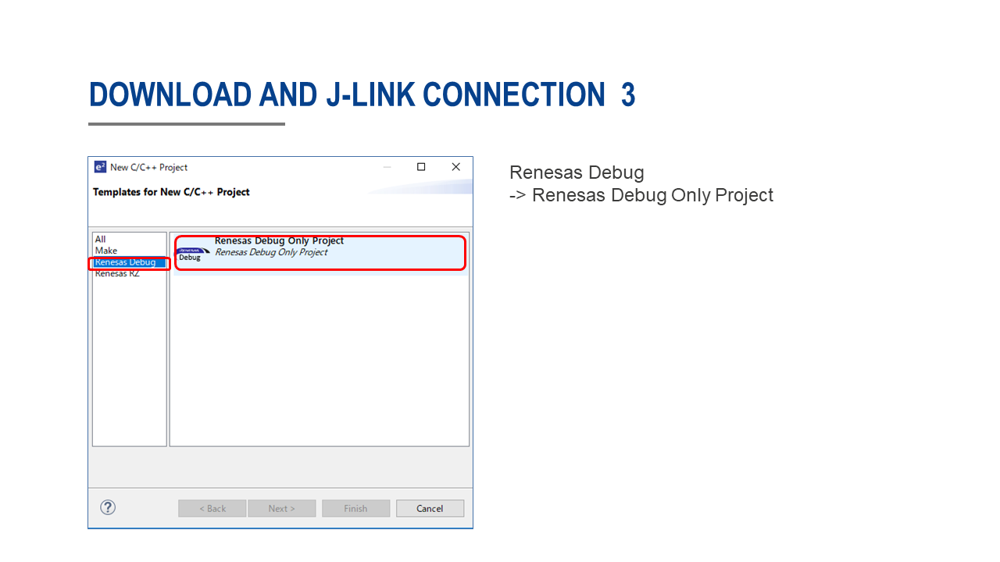
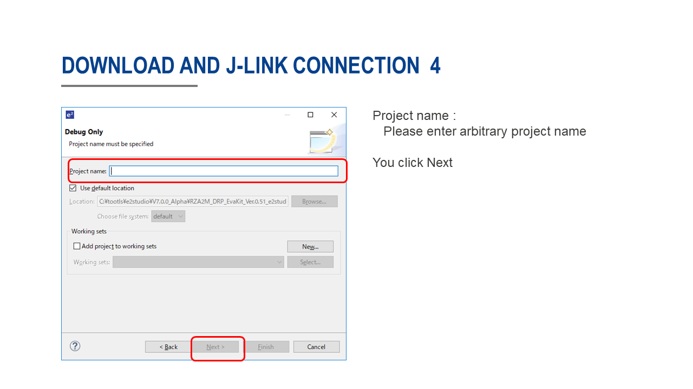
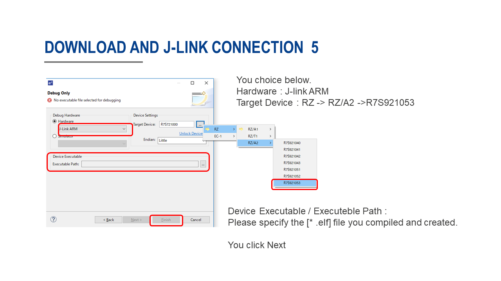
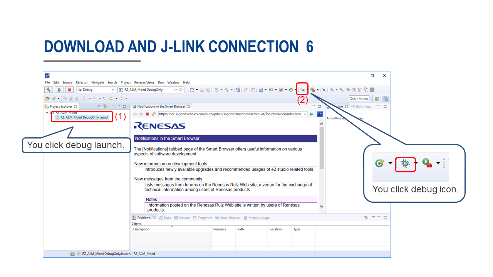
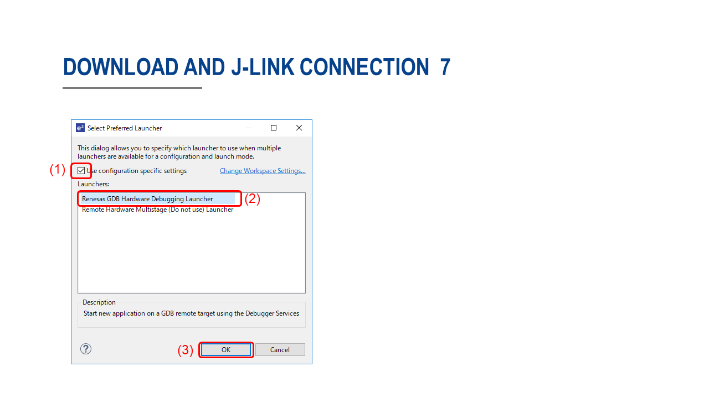
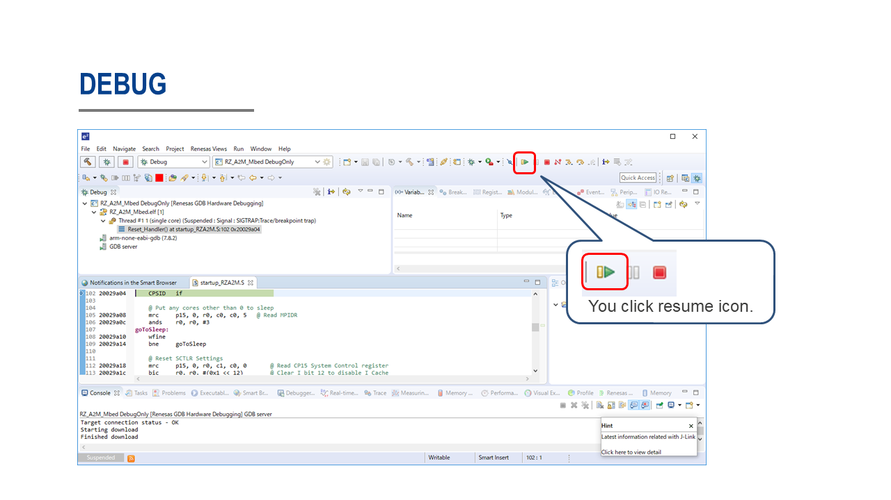

# RZ_A2M_Mbed_samples
This is a sample programs that works on RZ/A2M board.  


## Overview
You can try each sample program by changing the following macro. (main.cpp)  
```cpp
#define SAMPLE_PROGRAM_NO  0
```

| No.| Description                                                 | A | B | C | D | E |
|:---|:------------------------------------------------------------|:--|:--|:--|:--|:--|
|  0 | DigitalOut, InterruptIn, RTC, Timer and AnalogI             | x | x | x | x | x |
|  1 | FlashAPI sample                                             | x | x | x | x | x |
|  2 | SSIF loop back sample                                       | x | x | x | x |   |
|  3 | SPDIF loop back sample                                      |   |   | x |   |   |
|  4 | SSIF wav playback sample (use USB memory or SD card)        | x | x | x | x |   |
|  5 | SPDIF wav playback sample (use USB memory or SD card)       |   |   | x |   |   |
|  6 | LCD, Touch panel and JCU sample (use USB memory or SD card) | x | x | x | x |   |
|  7 | USBSerial (CDC) sample                                      | x | x | x | x | x |
|  8 | USBMouse sample                                             | x | x | x | x | x |
|  9 | USBKeyboard sample                                          | x | x | x | x | x |
| 10 | USBMIDI sample                                              | x | x | x | x | x |
| 11 | USBAudio sample                                             | x | x | x | x | x |
| 12 | USBAudio and SSIF sample                                    | x | x | x | x |   |
| 13 | Ether HTTP sample                                           | x |   | x | x |   |
| 14 | Ether HTTPS sample                                          | x |   | x | x |   |
| 15 | CEU, LCD and PWM sample                                     |   |   | x | x |   |
| 16 | USBMSD and FlashAPI sample                                  | x | x | x | x | x |
| 17 | USBMSD and FlashAPI sample advanced version                 | x | x | x | x | x |
| 18 | MIPI and LCD sample                                         |   |   | x | x |   |
| 19 | DRP Basic Operation Sample                                  |   |   | x | x |   |
| 20 | DRP Dynamic Loading Sample                                  |   |   | x | x |   |

A : [GR-PEACH](https://os.mbed.com/platforms/Renesas-GR-PEACH/) (RZ/A1H)  
B : [GR-LYCHEE](https://os.mbed.com/platforms/Renesas-GR-LYCHEE/) (RZ/A1LU)  
C : [RZ/A2M Evaluation Board Kit](https://www.renesas.com/jp/en/products/software-tools/boards-and-kits/eval-demo/rz-a2m-evaluation-board-kit.html) (RZ/A2M)  
D : [SBEV-RZ/A2M](http://www.shimafuji.co.jp/products/1486) (RZ/A2M)  
E : [SEMB1402](http://www.shimafuji.co.jp/products/1505) (RZ/A2M)  


## Development environment
Information of Mbed CLI that includes install&quick start guide is as the following.  
[Installation](https://github.com/ARMmbed/mbed-cli/blob/1.8.3/README.md#installation)  

How to import this sample  
```
$ cd <projects directory>
$ mbed import https://github.com/d-kato/RZ_A2M_Mbed_samples
$ cd RZ_A2M_Mbed_samples
$ mbed compile -m <TARGET> -t GCC_ARM --profile debug
```

## Test Environment
You can try Mbed OS for RZ/A2M with the following board.  

- [RZ/A2M Evaluation Board Kit](https://www.renesas.com/jp/en/products/software-tools/boards-and-kits/eval-demo/rz-a2m-evaluation-board-kit.html)  
Build command option :  
`$ mbed compile -m RZ_A2M_EVB -t GCC_ARM --profile debug`  
Board setting :  
Please set the dip switch SW6 of the SUB board as follows.
```
SW6-1  OFF  
SW6-2  OFF  
SW6-3  OFF  
SW6-4  OFF  
SW6-5  ON  
SW6-6  ON  
SW6-7  ON  
SW6-8  OFF  
SW6-9  OFF  
SW6-10 OFF  
```

- [SBEV-RZ/A2M](http://www.shimafuji.co.jp/products/1486)  
Build command option :  
`$ mbed compile -m RZ_A2M_SBEV -t GCC_ARM --profile debug`

- [SEMB1402](http://www.shimafuji.co.jp/products/1505)  
Build command option :  
`$ mbed compile -m SEMB1402 -t GCC_ARM --profile debug`


## Terminal setting
If you want to confirm the serial communication the terminal soft on your PC, please specify the below values.  
You can change the baud rate by ``platform.stio-baud-rate`` of ``mbed_app.json``.  

|             |         |
|:------------|:--------|
| Baud rate   | 115,200 |
| Data        | 8bit    |
| Parity      | none    |
| Stop        | 1bit    |
| Flow control| none    |


## How to download by use e2studio
Download [e2studio 7.0.0 or lator](https://www.renesas.com/eu/en/products/software-tools/tools/ide/e2studio.html), and install.  
Debugger : J-Link Base  

  
  
  
  
  
  
  
  
